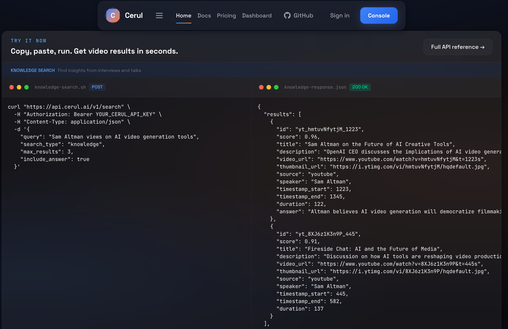

<div align="center">
  <br />
  <a href="https://cerul.ai">
    
  </a>
  <h1>Cerul</h1>
  <p><strong>Video understanding search API for AI agents.</strong></p>
  <p>Search what is shown in videos, not just what is said.</p>

  <p>
    <a href="https://cerul.ai/docs"><strong>Docs</strong></a> &middot;
    <a href="https://cerul.ai/docs#quickstart"><strong>Quickstart</strong></a> &middot;
    <a href="https://cerul.ai/docs#api-reference"><strong>API Reference</strong></a> &middot;
    <a href="https://cerul.ai/pricing"><strong>Pricing</strong></a> &middot;
    <a href="https://github.com/JessyTsui/cerul"><strong>GitHub</strong></a>
  </p>

  <p>
    <a href="./LICENSE"></a>
    
    
  </p>
</div>

<br />

<div align="center">
  
</div>

<br />

## Why Cerul

Web pages are easy for AI agents to search. **Video is not.**

Most video search today is limited to transcripts — what was *said*. Cerul goes further by indexing what is *shown*: slides, charts, product demos, code walkthroughs, whiteboards, and other visual evidence.

> [!NOTE]
> Cerul is in active development. The API is live at [cerul.ai](https://cerul.ai) — get a free API key to start.

## Quickstart

Index any video, then search it with one query:

```bash
curl "https://api.cerul.ai/v1/index" \
  -H "Authorization: Bearer YOUR_CERUL_API_KEY" \
  -H "Content-Type: application/json" \
  -d '{
    "url": "https://www.youtube.com/watch?v=hmtuvNfytjM"
  }'
```

```bash
curl "https://api.cerul.ai/v1/search" \
  -H "Authorization: Bearer YOUR_CERUL_API_KEY" \
  -H "Content-Type: application/json" \
  -d '{
    "query": "Sam Altman views on AI video generation tools",
    "max_results": 3,
    "include_answer": true,
    "filters": {
      "speaker": "Sam Altman",
      "source": "youtube"
    }
  }'
```

<details>
<summary><strong>Example search response</strong></summary>

```json
{
  "results": [
    {
      "id": "unit_hmtuvNfytjM_1223",
      "score": 0.96,
      "title": "Sam Altman on the Future of AI Creative Tools",
      "url": "https://cerul.ai/v/a8f3k2x",
      "snippet": "AI video generation tools are improving fast, but controllability and reliability still need work.",
      "thumbnail_url": "https://i.ytimg.com/vi/hmtuvNfytjM/hqdefault.jpg",
      "keyframe_url": "https://cdn.cerul.ai/frames/hmtuvNfytjM/f012.jpg",
      "duration": 5400,
      "source": "youtube",
      "speaker": "Sam Altman",
      "timestamp_start": 1223,
      "timestamp_end": 1345,
      "unit_type": "speech"
    }
  ],
  "answer": "Altman frames AI video generation as improving quickly, while noting that production-grade control is still the bottleneck.",
  "credits_used": 2,
  "credits_remaining": 998,
  "request_id": "req_abc123xyz456"
}
```

</details>

## Features

| | Feature | Description |
|---|---|---|
| **Visual Retrieval** | Beyond transcripts | Index slides, charts, demos, and on-screen content — not just speech |
| **Unified Search** | One query surface | Search summaries, speech segments, and visual evidence without choosing a track |
| **Unified Indexing** | `POST /v1/index` | Index YouTube, Pexels, Pixabay, and direct video URLs on the same pipeline |
| **Agent-Ready** | Built for LLMs | Designed for tool-use and function calling — clean JSON in, clean JSON out |
| **Timestamp Precision** | Frame-accurate results | Every result comes with exact start/end timestamps and confidence scores |
| **Installable Skills** | Codex & Claude | Drop-in agent skills with direct HTTP access — no MCP needed |
| **Open Core** | Apache 2.0 | Application code, pipelines, and agent integrations are open source |

## Architecture

```text
frontend/     Next.js app — landing page, docs, dashboard
api/          Hono / Cloudflare Workers API — public HTTP surface
workers/      Indexing pipelines and shared Python runtime helpers
docs/         Architecture, API specs, and runbooks
db/           Migrations and seed data
skills/       Agent skills for Codex / Claude-style clients
config/       YAML config defaults and templates
scripts/      Bootstrap and utility scripts
```

## Development

```bash
# Local development uses .env by default. Keep deployment-only secrets in .env.production.
# When .env points to the local docker database, rebuild.sh will start the compose db service automatically.

# Quick start — install deps, run database migrations, and start both servers
./rebuild.sh

# Apply SQL migrations manually (useful for remote or one-off database updates)
./scripts/migrate-db.sh

# Load a different env file explicitly when needed
./rebuild.sh --env-file ./.env.production
./scripts/migrate-db.sh --env-file ./.env.production

# Or run frontend and API separately
pnpm --dir frontend dev
npm --prefix api run dev -- --env development --ip 127.0.0.1 --port 8787
```

<details>
<summary><strong>Full command reference</strong></summary>

**Frontend**

```bash
pnpm --dir frontend install
pnpm --dir frontend dev
pnpm --dir frontend lint
pnpm --dir frontend test
pnpm --dir frontend build
```

**API**

```bash
npm --prefix api install
npm --prefix api run dev -- --env development --ip 127.0.0.1 --port 8787
npm --prefix api run check
```

**Workers**

```bash
python3 -m venv workers/.venv
workers/.venv/bin/python -m pip install -r workers/requirements.txt
workers/.venv/bin/pytest workers/tests
workers/.venv/bin/python -m workers.worker --db-url "$DATABASE_URL"
workers/.venv/bin/python -m workers.scheduler --once --database-url "$DATABASE_URL"
```

</details>

## Deployment

Deploy the frontend on Vercel:

1. Import the repository and set Root Directory to `frontend`
2. Keep the included `frontend/vercel.json`
3. Optionally set `NEXT_PUBLIC_SITE_URL` for custom domain metadata

Deploy the API from `api/` with `wrangler deploy`.

For API or worker deployments, run `./scripts/migrate-db.sh` once against the target
database as a release/predeploy step before rolling out code that depends on the new schema.

## Project Status

- [x] Shared platform backbone: auth, API keys, usage tracking, rate limiting, dashboard, and docs
- [x] Unified `index + search` flow on the shared retrieval stack
- [x] Summary, speech, and visual retrieval units in one embedding space
- [x] Agent-facing integrations via installable skills and direct HTTP access
- [ ] Higher-scale production validation for indexing coverage and retrieval quality
- [ ] Stripe billing validation in test mode
- [ ] Python & TypeScript SDKs, only if direct API + skill access proves insufficient

## Community

- [Contributing Guide](./CONTRIBUTING.md)
- [Security Policy](./SECURITY.md)
- [Code of Conduct](./CODE_OF_CONDUCT.md)

## License

Licensed under [Apache 2.0](./LICENSE).

<div align="center">
  <br />

  [](https://star-history.com/#JessyTsui/cerul&Date)

  <br />
  <sub>Built by <a href="https://github.com/JessyTsui">@JessyTsui</a></sub>
</div>
