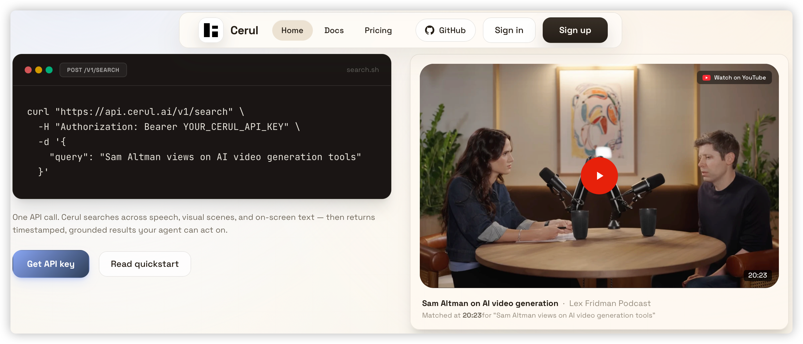
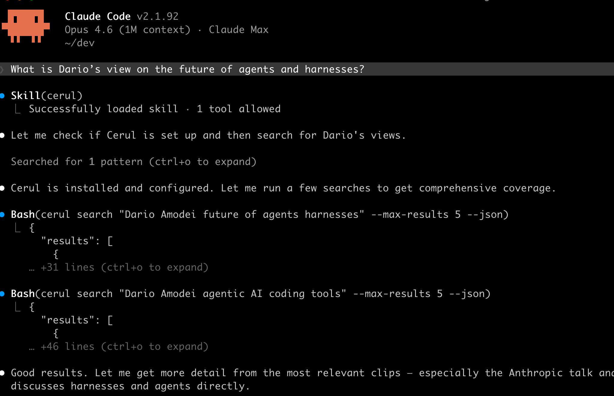
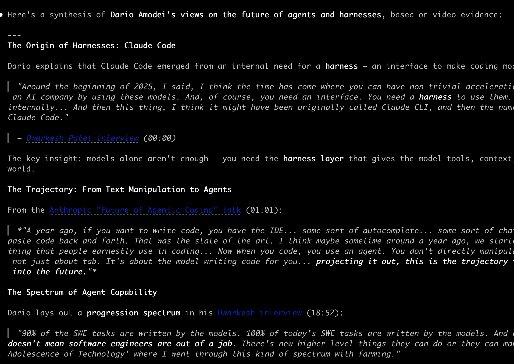
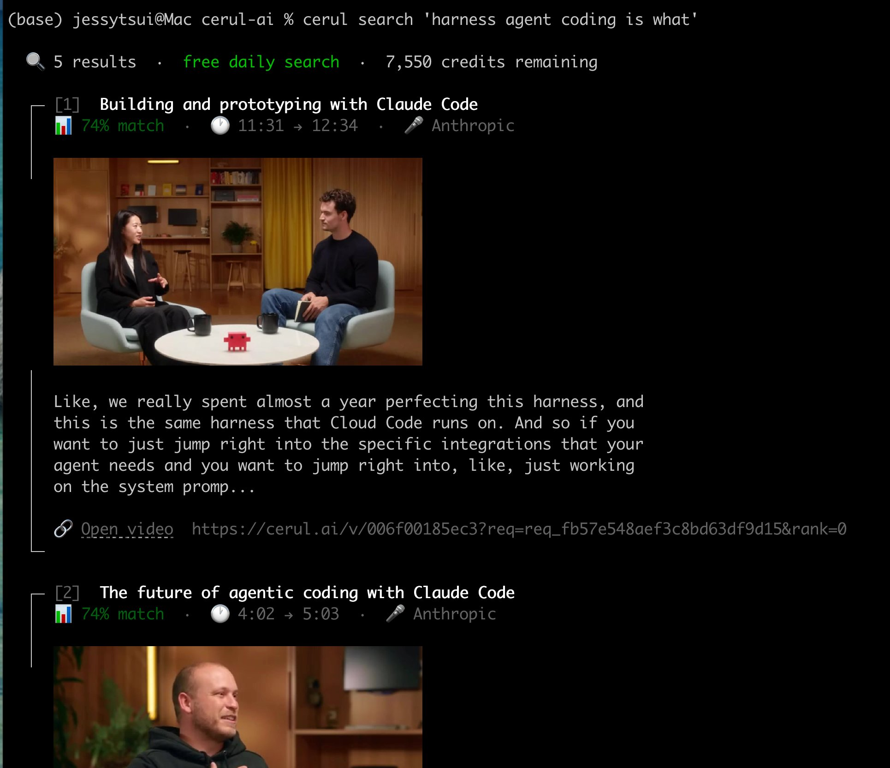

<div align="center">
  <br />
  <a href="https://cerul.ai">
    
  </a>
  <h1>Cerul</h1>
  <p><strong>The video search layer for AI agents.</strong></p>
  <p>Teach your AI agents to see — search by meaning across visual scenes, speech, and on-screen content.</p>

  <p>
    <a href="https://cerul.ai/docs"><strong>Docs</strong></a> &middot;
    <a href="https://cerul.ai/docs/search-api"><strong>API Reference</strong></a> &middot;
    <a href="https://cerul.ai/pricing"><strong>Pricing</strong></a> &middot;
    <a href="https://x.com/cerul_hq"></a>
  </p>

  <p>
    <a href="./LICENSE"></a>
    <a href="https://www.npmjs.com/package/cerul"></a>
    <a href="https://pypi.org/project/cerul"></a>
  </p>
</div>

<br />

<div align="center">
  
</div>

<br />

<div align="center">
  <video src="https://github.com/user-attachments/assets/e0982048-3b40-42b9-80b6-a79b401d2355" width="720" autoplay loop muted playsinline></video>
</div>

<br />

## Why Cerul

Web pages are easy for AI agents to search. **Video is not.**

Most video search today is limited to transcripts — what was *said*. Cerul goes further by indexing what is *shown*: slides, charts, product demos, code walkthroughs, whiteboards, and other visual evidence.

> [!NOTE]
> Cerul is in active development. The API is live at [cerul.ai](https://cerul.ai) — sign up to get a free API key.

## Quickstart

### Use with your AI agent

Copy this and send it to your agent (Claude Code, Codex, Cursor, etc.):

```
Install the Cerul video search skill by reading and following https://github.com/cerul-ai/cerul/blob/main/skills/cerul/SKILL.md
```

Your agent will install the CLI, set up credentials, and start searching videos as a tool.

<div align="center">
  
  
</div>

Or install via the skills CLI:

```bash
npx skills add cerul-ai/cerul
```

### CLI

```bash
curl -fsSL https://cli.cerul.ai/install.sh | bash
cerul search "Sam Altman on AI video generation tools"
```

<div align="center">
  
</div>

> Inline video frame previews are supported in iTerm2, WezTerm, and Kitty. Enable with `cerul config` and toggle **Images** on. Other terminals show text-only results.

### MCP (Model Context Protocol)

Connect any MCP-compatible client to the hosted endpoint (replace with your API key):

```bash
# Claude Code
claude mcp add --transport streamable-http "https://api.cerul.ai/mcp?apiKey=YOUR_API_KEY" cerul

# Codex
codex mcp add --url "https://api.cerul.ai/mcp?apiKey=YOUR_API_KEY" cerul
```

Also works with Claude Desktop, Cursor, Windsurf, and other MCP clients.

<details>
<summary><strong>SDK & API</strong></summary>

**Python**

```bash
pip install cerul
```

```python
from cerul import Cerul

client = Cerul(api_key="YOUR_API_KEY")
results = client.search(query="Sam Altman on AGI timeline", max_results=5)

for r in results:
    print(r.title, r.url)
```

**JavaScript**

```bash
npm install cerul
```

```javascript
import { cerul } from "cerul";

const client = cerul({ apiKey: "YOUR_API_KEY" });
const result = await client.search({ query: "Sam Altman on AGI timeline", max_results: 5 });

for (const r of result.results) {
  console.log(r.title, r.url);
}
```

**cURL**

```bash
curl "https://api.cerul.ai/v1/search" \
  -H "Authorization: Bearer YOUR_API_KEY" \
  -H "Content-Type: application/json" \
  -d '{"query": "Sam Altman on AGI timeline", "max_results": 5}'
```

Full API spec: [`openapi.yaml`](./openapi.yaml) | [cerul.ai/docs](https://cerul.ai/docs/search-api)

</details>

## License

Licensed under [Apache 2.0](./LICENSE).

<div align="center">
  <br />

  [](https://star-history.com/#cerul-ai/cerul&Date)

  <br />
  <sub>Built by <a href="https://github.com/JessyTsui">@JessyTsui</a></sub>
</div>
